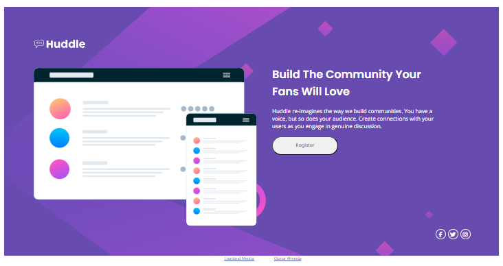

# Quest HTML + CSS Avançado - DevQuest

Este desafio proposto pelo DevQuest tem como objetivo demonstrar todo o aprendizado ao longo do curso de HTML e CSS.

# Índice

- [Visão Geral](#visão-geral)
    - [Desafio](#desafio)
    - [Screenshot](#screenshot)
    - [Links](#links)
- [Processo de desenvolvimento](#processo-de-desenvolvimento)
- [Autor](#autor)

## Visão Geral

### Desafio

- Desktop design:

    

- Mobile design:

    

- Active states:

    

### Screenshot

### Links

- Link do desafio: [Huddle landing page with a single introductory section](https://www.frontendmentor.io/challenges/huddle-landing-page-with-a-single-introductory-section-B_2Wvxgi0)

- Link do Projeto: [Github - Desafio HTML + CSS](https://github.com/osmarajr/quest-devquest-huddle-landing-page)

- Link do site: [Github - Pages](https://osmarajr.github.io/quest-devquest-huddle-landing-page/)

## Processo de desenvolvimento

Todo código feito no [VSCODE](https://code.visualstudio.com/) utilizando seguinte recursos:

- Estruturação com HTML5 semântico
- Personalização no CSS3
- Alinhamento dos elements com Flexbox
- Web Design responsivo utilizando Media Queries
- Fontes utilizadas do [Google Fonts](https://fonts.google.com/)
- Icones utilizadas do [Font Awesomes](https://fontawesome.com/icons)

## Autor

- [GitHub - Osmar Almeida](https://github.com/osmarajr)
- [Linkedin](www.linkedin.com/in/osmar-junior-473a26b4)

